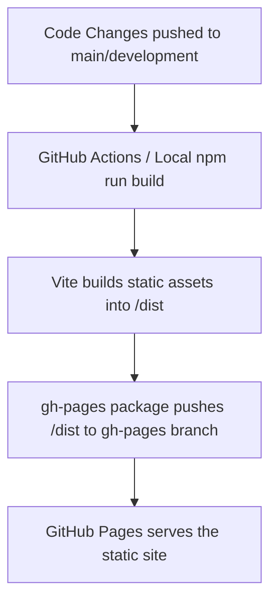

<p align="center">
  
</p>

<h3 align="center">Elison Tuscano's Personal Portfolio</h3>

<p align="center">
  A modern, responsive, and statically generated personal portfolio website built with React, TypeScript, and Vite.
</p>

<p align="center">
  <b>
    <a href="https://elisontuscano.github.io">Live Website</a> &nbsp;·&nbsp;
    <a href="https://linkedin.com/in/elisontuscano">LinkedIn</a> &nbsp;·&nbsp;
    <a href="./dev/spec/001-architecture-design.md">Architecture Spec</a>
  </b>
</p>

<p align="center">
  
  
  
  
  
</p>

## ✨ About the Project

This repository contains the source code for my personal portfolio website, hosted on GitHub Pages. The design philosophy centers on clean aesthetics, speed, and mobile-first responsiveness. The site is entirely static, with no backend—content is driven dynamically through static JSON data files and Markdown content, allowing for easy updates and low maintenance.

### Key Features

| Feature | Description |
|---|---|
| **Dark/Light Mode** | Seamless theme switching with persistence via `localStorage` and custom CSS properties. |
| **Data-Driven Sections** | Experience, Skills, Education, and Projects content is rendered from modular `.json` files. |
| **Markdown Blog** | Integrated Markdown parser (`react-markdown`) with syntax highlighting for technical blog posts and notes. |
| **Papershelf** | A dedicated section for cataloging and linking research papers and personal study notes. |
| **Animations** | Smooth reveal animations using the `IntersectionObserver` API, typing effects, and hover transitions. |

## 🏗️ Tech Stack & Architecture

- **Framework**: [React](https://react.dev/) via [Vite](https://vitejs.dev/) for rapid, modern builds.
- **Language**: [TypeScript](https://www.typescriptlang.org/) configured with strict mode for type safety.
- **Styling**: Component-scoped **CSS Modules** combined with **CSS Custom Properties** (Variables) for flexible theming. No heavy CSS-in-JS runtime.
- **Routing**: [React Router v6](https://reactrouter.com/) using `HashRouter` for GitHub Pages compatibility without server rewrites.
- **Content Rendering**: `react-markdown`, `remark-gfm`, and `rehype-highlight` for rendering blog posts.
- **Icons**: `react-icons` for lightweight, tree-shakeable icons.

<details>
<summary><b>View Build & Deployment Flow</b></summary>



</details>

## 🚀 Local Development

Follow these steps to run the portfolio locally for development or testing:

1. **Clone the repository:**
   ```bash
   git clone https://github.com/elisontuscano/elisontuscano.git
   cd elisontuscano
   ```

2. **Install dependencies:**
   ```bash
   npm install
   ```

3. **Start the development server:**
   ```bash
   npm run dev
   ```
   The site will be available at `http://localhost:5173`.

4. **Run tests & linting:**
   ```bash
   npm run test
   npm run lint
   npm run format:check
   ```

## 📦 Deployment

The site is built as a static application and deployed to GitHub Pages. 

To deploy a new version manually:
```bash
npm run deploy
```
This script builds the project to the `dist/` directory and publishes it to the `gh-pages` branch using the `gh-pages` npm package.

---
<p align="center">
  <i>Designed and built by Elison Tuscano.</i>
</p>
